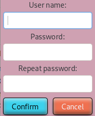
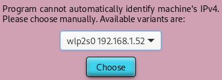
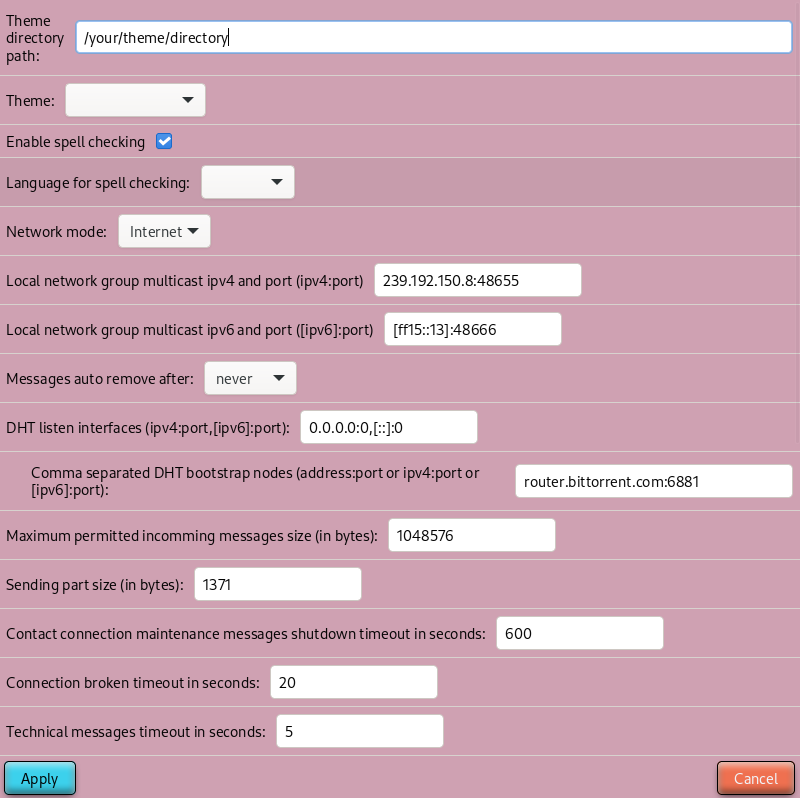
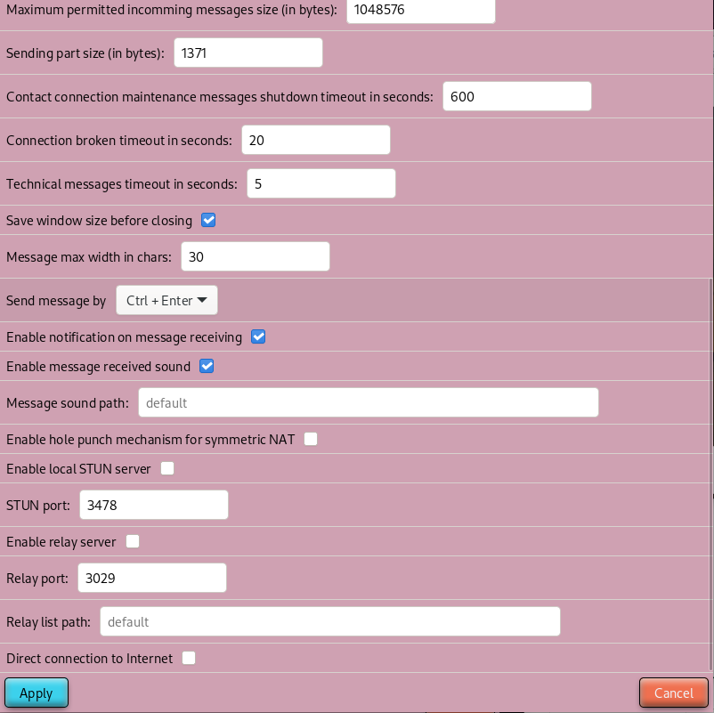

# Communist

Communist is a simple p2p messenger.

## Description

Communist is a simple GTK 4 based p2p messenger. It uses torrent DHT combined with UDP hole punch technique to establish direct connection between users. Program can work in two modes: local network and internet, both IPv4 and IPv6 protocols are supported. At the moment Communist has two possibilities: you can send simple text messages and files. All your messages and files are stored encrypted and being sent encrypted (AES encrypting algorithm combined with ed25519, see source code for more details). Project based on [libcommunist](https://github.com/ProfessorNavigator/libcommunist) library.

## Installation

### Linux

`git clone https://github.com/ProfessorNavigator/communist.git`\
`cd communist`\
`meson -Dbuildtype=release build`\
`ninja -C build install`

You may need superuser privileges to execute last command.

### Windows

You can build Communist from source by MSYS2 project [https://www.msys2.org/](https://www.msys2.org/). Follow installation instructions from their site. Install dependencies from [Dependencies](#dependencies) section and git. Than create folder where you want to download source code (path must not include spaces or non Latin letters). Open MinGW console and execute following commands (in example we will download code to C:\Communist):

`mkdir /c/Communist`\
`cd /c/Communist`\
`git clone https://github.com/ProfessorNavigator/communist.git`\
`cd communist`\
`meson -Dbuildtype=release build`\
`ninja -C build install`

If everything was correct, you can find communist.exe file in `your_msys2_folder/mingw_folder/bin`.

## Dependencies

Communist uses meson building system, so to build it from source you need meson and ninja.\
Also you need to download and install [libcommunist](https://github.com/ProfessorNavigator/libcommunist) library.
Then you need [gtkmm-4.0](http://www.gtkmm.org/), [icu](https://icu.unicode.org/) (version >= 69), [hunspell](https://github.com/hunspell/hunspell). All libraries must have headers (for building), so if you use for example Debian Linux, you need ...-dev versions of packages.

You may also need to install Good plugins for gstreamer. They are used to play default sound signals.

## Usage

- On startup program will offer you to create  user.\
		\
		User name and password can be either you want, but author advises you to make them as reliable as possible - program uses user name and password to encrypt your local data.
- Next step - creation of your profile.\
		\
If you want to add avatar click `Open image` button (supported formats depend on your version of GDK Pixbuf and its settings)
- Now everything is almost ready. Last thing - add friends. Press `Add contact` button and input friends' key. Of course you need to send each other your public keys first (by email for example).\
		
		
Your public key can be found in `Instruments->Own key`.

If program could not automatically determine your net interface on startup, you will see window with proposition to choose proper interface. Such thing can happen if your machine is connected to two or more networks.

In such case choose proper net interface and press `Choose` button.

You can transmit your messages by relay servers (if any is available) - see `Contacts->Edit contacts to send by relay`.

### Limitations
If your access to Internet is carried out through the IPv4 and so called [symmetric NAT](https://en.wikipedia.org/wiki/Network_address_translation) you may need to use some kind of proxy or VPN. Communist has mechanism for hole punching even in case of symmetric NAT behaviour, but it is not properly tested and in any way is not reliable because of symmetric NAT features. Besides hole punching in case of symmetric NAT will increase traffic consumption significantly. And the best way for successful hole punching in any case is to use IPv6.

## Settings

### Settings window

Program have several settings, which can be found in `Instruments->Settings`.

You do not need change anything if everything works fine 'out of the box'. In other case...

`Theme directory path` - you can create your own themes. Put theme to special directory and copy its path to this field. Default value is path to default themes directory.

`Theme` - you can choose appearance of the program. There are three themes available now: default, soviet_union and system_default. You can create your own theme. Create theme directory (directory name is theme name) and put it to directory indicated in `Theme directory path`. Theme directory must contain four files: background.jpeg (this is background of main window), file-icon.png (icon on "attach file" button), ico.png ("send message" button) and mainWindow.css (some necessary styling, see existing files in default themes directory as example).

Spell checking is carried out by libhuspell. You can enable/disable it completely or change language. Only two languages are available now: English and Russian. To add your own variant open `share/Communist/HunDict/languages`, add there line with number and language name, then add to `share/Communist/HunDict` directory with the name same as number and put in it proper hunspell dictionaries (names of files must be `dic.aff` and `dic.dic`) Global language of the program can be changed by `LANG` variable. Available languages are the same, default language is English, Russian can be enabled by setting `LANG=ru_RU` (it will happen automatically if your system uses proper locale). If you want assist to translate the program, see source code (program uses GNU gettext).
 
 `Network mode` has two variants: Internet and Local. In `Internet` mode program will use DHT ([libtorrent-rasterbar](https://www.libtorrent.org/) implementation now, see [libcommunist](https://github.com/ProfessorNavigator/libcommunist) for details) to find friend's ip and establish direct connection. In `Local` mode DHT is disabled, program will send multicast UDP datagrams trying to find contacts. Next two lines indicate group addresses and ports to be used (be careful, they must be the same on all machines you want establish connection with). 
 
 Message auto remove is introduced  to save memory - all messages you have sent and received are stored on your hard drive. So you will need to clean them time to time (also you can remove messages manually one by one - there is proper item in each message context menu).
 
 `DHT listen interfaces` - libtorrent setting, indicates ip addresses and ports DHT sockets to be bound to. Zero values mean "default". If your machine has "white" ip address, consider changing this setting and publishing it anywhere to help other users on bootstrap to DHT network.
 
 `DHT bootstrap nodes` setting indicates which nodes Communist will try to bootstrap to on very first connection to network. Later, if first bootstrap operation was successful, Communist will use information from cached file (~/.cache/libcommunist/dhtstate on Linux and C:\Users\\'user'\\.cache\libcommunist\dhtstate on Windows).
 
 Incoming message size limit is included to prevent possible attacks. You can change it to any value you suppose safe.
 
 `Sending part size...` Your message will be sent part to part with hash checking of each part on receiving. This parameter indicates size of the part. It is not recommended to make it too small - technical traffic will increase. At the same time it is not recommended to make this parameter too big - in case of any errors program will try to resend part, so it will increase traffic consumption too.
 
 `Contact connection...` parameter shows after how many seconds contact state will be considered as 'offline'. In this case attempts to connect will be stopped until program receives new ip address from DHT.
 
 `Connection broken...` parameter shows after how many seconds contact will be considered as disconnected (after that label 'online' on contacts' button will disappear).
 
 `Save window size...` - if checked Communist will restore main window size on next launch.
 
 `Message max width...` - regulates message frame width.
 
 `Send message by` - only two variants are available now: Ctrl + Enter and Enter.
 
 `Enable notification...` - enables system notification on message receiving. No any warranty, that anything will be showed (see [this](https://developer-old.gnome.org/glibmm/unstable/classGio_1_1Application.html#a76d3d76f750a48fdbb965079b6619209) for details).
 
 `Enable message receive sound` - enables sound notification on message receiving.
 
 `Message sound path` - if this line is empty, program will try to use default signal. To use your own signal, input full path.
 
 `Enable hole punch mechanism...` - enables hole punch mechanism in case if symmetric NAT has been detected. This function was not properly tested - better to keep it disabled. Enable it only in case if other variants (relay server, VPN, proxy) are not available.
 
 `Enable local STUN server` - enables local STUN server (not compliant with RFCs, only for Communist network). Please, check it, if you have direct access to the Internet.
 
 `STUN port` - port to be used with Communist STUN servers and requests. Must be the same on all machines in the same overlay network.
 
 `Enable relay server` - enables local relay server to retransmit messages of other users of Communist net. Enable it if you have direct access to internet and want to help other people to communicate.
 
 `Relay port` - port number to use within relay operations (relay server operations and transmitting your own messages by relay servers).
 
 `Relay list path` - program searches relay server automatically, but you can add your own variants. Create text file and put absolute path to it to this field. Each address in file must be in separate line and has format “192.168.1.1:1234”.
 
 `Direct connection to Internet` - check it, if you have it. This option disables requests to STUN servers.
 
 Warning! After you press 'Apply' button program will be closed. You need to restart it manually.
 
### STUN list
 
 Program uses STUN servers to determine own 'external' IPv4 address. Some server addresses are already placed to `share/Communist/StunList` file, but you may need to change them. Program will work even with one STUN server available, but optimal quantity is three (3). Each server address must be placed to new line and must include ip  address and port or 'string' address and port (see default StunList file as example). If you place addresses in 'string' form, be aware that program needs to determine their ips  by DNS request first,  this operation may take some time on startup.

## Plans
 
 Author wants to add more message types, such as voice messages, video messages, direct p2p audio and video calling. But unfortunately he is not qualified on audio and video recording, so it may take some time. Also he wants to add group and channel functionality, but unfortunately due to IPv4 features (NAT) this can be realised only for IPv6 networks (if you have any ideas, please contact author by e-mail or on GitFlic and GitHub). 

## License

GPLv3 (see `COPYING`).

## Donation

If you want to help on developing this project, you can assist it by [donation](https://yoomoney.ru/to/4100117795409573) or by code development (contact author by email to obtain access to repositories)

## Contacts

You can contact author by email \
bobilev_yury@mail.ru